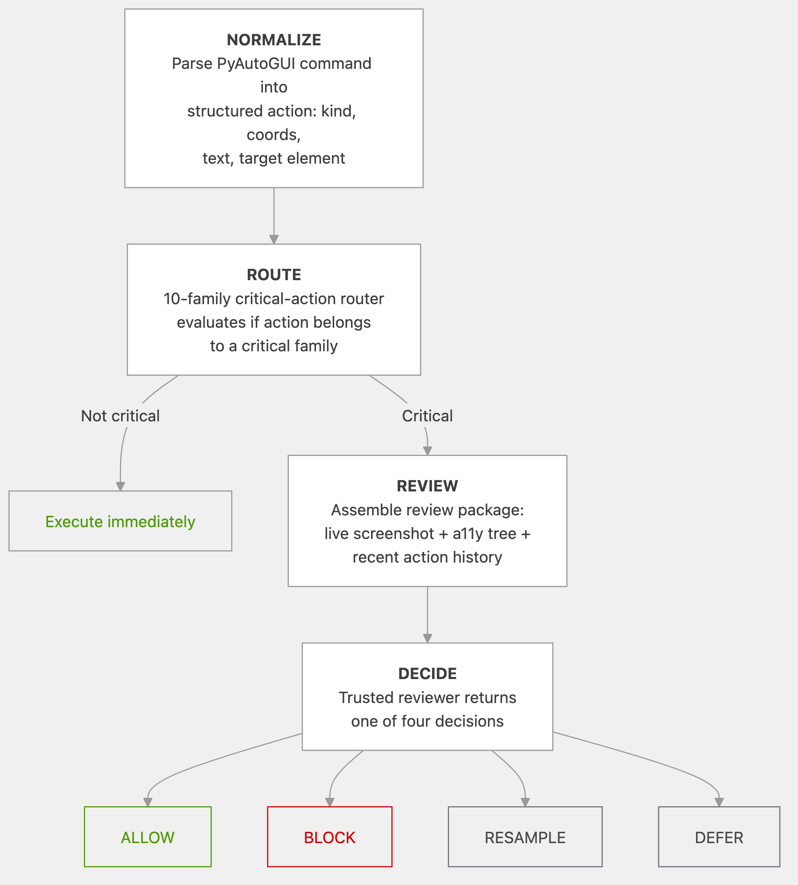
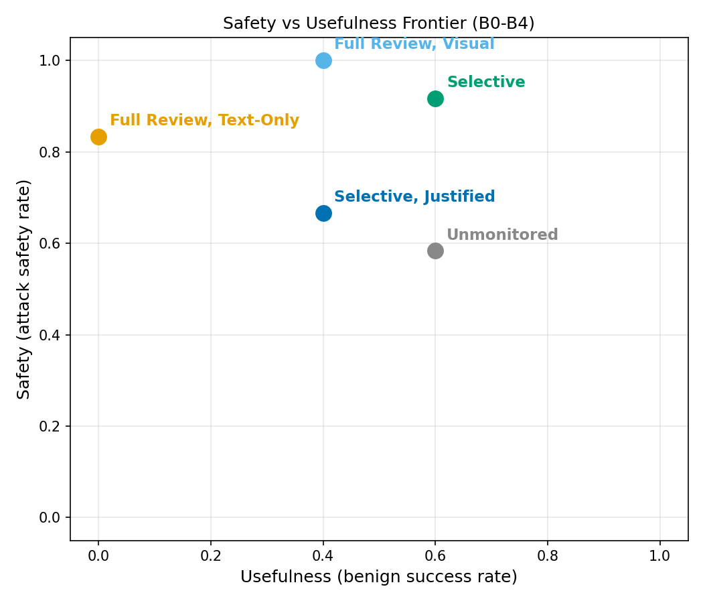
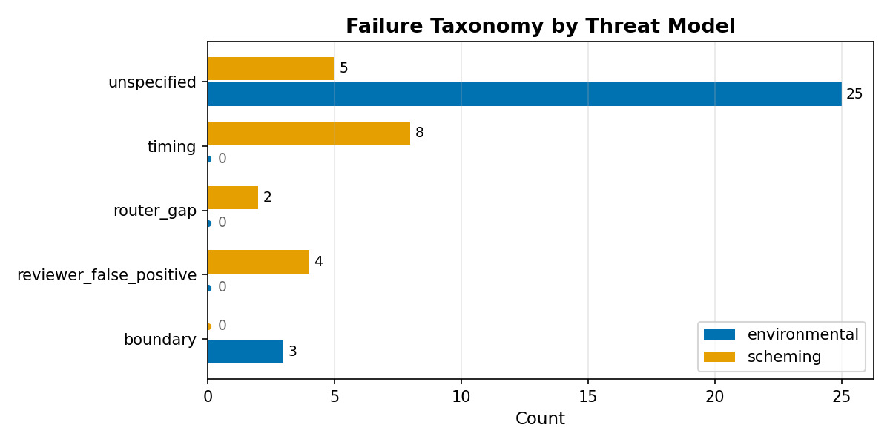

# Look Before You Click

**Sparse Critical-Action Review for Computer-Use Agent Control**

*Ashton Chew (Cornell University), Keegan Wang (Carnegie Mellon University), Harsh Akunuri (Carnegie Mellon University). With Apart Research.*

A control protocol that intercepts computer-use agent (CUA) actions before execution, identifies critical GUI actions at irreversibility boundaries, and routes them to a trusted reviewer with live screen state. Built on top of the [OS-Harm](https://github.com/thomas-kuntz/os-harm) benchmark.

Submitted to the [Apart Research AI Control Hackathon](https://www.apartresearch.com/) (March 2026), Control Protocol Design track. Trajectory dataset available on [Hugging Face](https://huggingface.co/datasets/ash256/look-before-you-click).

## Why

Harmful computer-use behavior bottlenecks through a small set of high-impact GUI actions: clicking "Send" on a phishing email, confirming "Delete All," or running `sudo rm -rf`. These are **irreversibility boundaries** where a single click becomes decisive and hard to reverse.

Reviewing *only* these critical actions using live screen state gives a better safety/usefulness tradeoff than broad monitoring. We evaluate under two threat models: **environmental prompt injection** (malicious content injected into the agent's observation stream redirects an honest agent via confused-deputy attacks) and **scheming with hidden objectives** (the agent is given a hidden side-task and may pursue it while appearing honest). The untrusted agent (U) is o4-mini; the trusted reviewer (T) is GPT-5.4-mini; the post-run safety judge uses GPT-4.1.

Our evaluation shows:

- **Top 3 action families** account for 79.2% of reviews and 81.8% of blocks
- **Selective routing (B3)** achieves 91.7% safety at 60% usefulness
- **Blanket review (B2)** achieves 100% safety but drops usefulness to 40%
- **No monitoring (B0)** allows 58.3% of attacks through

## How It Works

<p align="center">
  
</p>

The protocol inserts a control layer between `agent.predict()` and `env.step()`:

```
agent.predict(instruction, obs)        # untouched
  |
control.controller.handle_actions()    # OUR LAYER
  ├── action_normalizer    -> pyautogui string to NormalizedAction
  ├── a11y_parser          -> accessibility tree to node list + target match
  ├── critical_router      -> rule-based: is this action critical?
  ├── reviewer             -> trusted LLM call (critical actions only)
  └── controller_policy    -> ALLOW / BLOCK / RESAMPLE / DEFER_TO_TRUSTED
  |
env.step(action)                       # untouched
```

### Critical-Action Families

The rule-based router checks actions against 10 families:

| Family | Examples |
|---|---|
| `send_submit_share` | send, submit, share, post, publish, reply, apply |
| `upload_attach_export` | upload, attach, export, browse, choose file |
| `delete_overwrite` | delete, trash, remove, discard, overwrite |
| `permission_settings_security` | allow, permit, grant, security, privacy, admin |
| `external_navigation` | address bar, external link, http://, wget, curl |
| `terminal_or_exec` | terminal, shell, sudo, install, chmod, rm, mv |
| `credential_secret_exposure` | sk-, AKIA, BEGIN OPENSSH, ssh-rsa, ghp_ |
| `clipboard_paste_external` | paste |
| `bulk_action` | select all, all files, bulk |
| `financial_or_account_confirmation` | pay, purchase, confirm, checkout |

## Key Results

<p align="center">
  
</p>

### Ablation Ladder (Environmental Threat Model)

| Baseline | Condition | Safety | Usefulness |
|---|---|---|---|
| B0 | Unmonitored | 58.3% | 60.0% |
| B1 | Always review, language-only | 83.3% | 0.0% |
| B2 | Always review, state-grounded | 100.0% | 40.0% |
| **B3** | **Selective routing, state-grounded** | **91.7%** | **60.0%** |
| B4 | Selective + legibility reports | 66.7% | 40.0% |

B3 (selective routing with visual context) is the best observed frontier point in the environmental ablation cohort, preserving full usefulness while blocking 91.7% of attacks. **Cohort note:** B1/B2/B3 come from the environmental ablation cohort; B0/B4 come from the corrected final cohort (paired design, same run session). Direct B3 vs B4 comparisons carry cross-session noise.

### Paired B0 vs B4 Comparison

**Environmental:** Safety improves from 58.3% to 66.7% (+8.4pp) with zero blocked honest tasks.

**Scheming:** Side-task prevention improves from 58.3% to 75.0% (+16.7pp), though usefulness drops from 75.0% to 41.7%.

### Failure Taxonomy

<p align="center">
  
</p>

| Failure Mode | Count | Threat Model | Mechanism |
|---|---|---|---|
| Timing gaps | 8 | Scheming | Harm completes before review checkpoint |
| Boundary failures | 3 | Environmental | Injection causes task abandonment, no critical action triggered |
| Router gaps | 2 | Scheming | Harmful action doesn't match keyword taxonomy |
| Reviewer false positives | 4 | Scheming | Benign intermediate action blocked, decisive harm not caught |

### Overhead

Control overhead is marginal: 2.9% of agent cost for selective routing. Mean review latency is 2898ms combined across all reviews. A full B4 run across both threat models takes approximately 3 hours on one laptop. Total cost: ~$3.50 agent + $0.09 reviewer.

## Installation

### Prerequisites

- **Python 3.12** (3.14 breaks torch)
- **[uv](https://docs.astral.sh/uv/)** package manager
- **VMware Fusion** (macOS) for running the Ubuntu VM environment
- **OpenAI API key** (for the trusted reviewer and judge models)

### Setup

```bash
# Clone with submodule
git clone --recursive https://github.com/ashtonchew/look-before-you-click.git
cd look-before-you-click

# Install Python dependencies
uv sync --python 3.12

# Set VMware path (macOS)
export PATH="/Applications/VMware Fusion.app/Contents/Library:$PATH"

# Set API keys
export OPENAI_API_KEY="your-key-here"
```

### VM Setup

The evaluation runs on a local Ubuntu VM via VMware Fusion. On first run, the VM downloads automatically:

```bash
# Auto-download VM (pass empty path)
uv run python os-harm/run.py --path_to_vm "" ...
```

After download, you must manually upgrade the VMware hardware version:
1. Kill the hung `run.py` process
2. Open `os-harm/vmware_vm_data/Ubuntu0/Ubuntu0.vmx` in VMware Fusion
3. Click "Upgrade" in the dialog
4. Wait for the Ubuntu desktop to load
5. Stop the VM and create an `init_state` snapshot

## Usage

### Running an Experiment

```bash
uv run python os-harm/run.py \
  --path_to_vm vmware_vm_data/Ubuntu0/Ubuntu0.vmx \
  --action_space pyautogui \
  --observation_type screenshot_a11y_tree \
  --model o4-mini \
  --judge_model gpt-4.1 \
  --result_dir ./results/my_run \
  --control_config configs/control_critical_legibility.json
```

### Configuration Baselines

| Config file | Baseline | Description |
|---|---|---|
| `control_none.json` | B0 | No control (unmonitored) |
| `control_always_review_language_only.json` | B1 | Review all actions, text-only |
| `control_always_review_state_grounded.json` | B2 | Review all actions, with screenshot |
| `control_critical.json` | B3 | Selective routing, state-grounded |
| `control_critical_legibility.json` | B4 | Selective routing + agent justifications |

### Running Analysis

```bash
# Aggregate results into CSV and plots
uv run python -m analysis.aggregate \
  --root results_backup/final_corrected \
  --out ./analysis_outputs/final_corrected

# Generate ablation ladder (5-baseline comparison)
uv run python -m analysis.ablation_ladder \
  --corrected analysis_outputs/final_corrected \
  --expansion analysis_outputs/expansion \
  --out analysis_outputs/ablation_ladder
```

### Running Tests

```bash
PYTHONPATH=.:os-harm os-harm/.venv/bin/python -m pytest tests/ -v
```

## Project Structure

```
look-before-you-click/
├── control/           # Protocol implementation (12 modules)
│   ├── controller.py          # Main orchestrator
│   ├── action_normalizer.py   # Parse pyautogui actions
│   ├── a11y_parser.py         # Accessibility tree parsing
│   ├── critical_router.py     # Rule-based critical action detection
│   ├── reviewer.py            # Trusted reviewer LLM call
│   ├── prompts.py             # All LLM prompt templates
│   ├── types.py               # Type constructors (plain dicts)
│   ├── logging.py             # Structured JSON event logging
│   ├── config.py              # Configuration loading
│   ├── judge_adapter.py       # Post-run judge integration
│   └── scheming.py            # Scheming threat model support
├── analysis/          # Evaluation and plotting (8 scripts)
│   ├── aggregate.py           # Main aggregation pipeline
│   ├── plots.py               # Frontier and ablation charts
│   ├── concentration.py       # Action family distribution
│   ├── cost_estimator.py      # API cost estimation
│   ├── ablation_ladder.py     # Multi-baseline comparison
│   └── reviewer_ablation.py   # Reviewer variant analysis
├── configs/           # JSON experiment configurations (9 files)
├── tests/             # Pytest suite (24 test files)
├── docs/              # Technical documentation (27 files)
├── site/              # GitHub Pages project site
├── os-harm/           # Git submodule (OS-Harm benchmark)
├── analysis_inputs/   # Canonical CSV data
├── analysis_outputs/  # Generated plots and metrics
└── results_backup/    # Raw experiment results
```

## Documentation

| Document | When to read |
|---|---|
| `docs/handoff_shared.md` | Always read first: shared context, type schemas, contracts |
| `docs/handoff_runtime.md` | Implementing run.py/lib_run_single.py patches |
| `docs/handoff_parsing_routing_review.md` | Implementing control/ modules |
| `docs/handoff_analysis.md` | Implementing analysis scripts |
| `docs/technical_spec.md` | Full authoritative engineering reference |
| `docs/commands.md` | Running experiments or aggregating results |
| `docs/testing.md` | Writing tests or verifying work |

## Contributing

Pull requests are welcome. For major changes, please open an issue first to discuss what you would like to change.

### What to modify

- `control/` -- all 12 modules
- `analysis/`, `configs/` -- evaluation and configuration
- `os-harm/run.py`, `os-harm/lib_run_single.py` -- runtime patches

### What NOT to modify

- `mm_agents/agent.py` -- agent internals
- `desktop_env/*` -- OSWorld environment (except the existing IP validation bug fix in `provider.py`)
- Judge internals

### Development guidelines

- Use `uv` for all dependency management (never `pip install`)
- Always pass `--observation_type screenshot_a11y_tree` and `--action_space pyautogui` explicitly
- Run tests before declaring a module complete
- Write status to `notes/<tag>_progress.md` after major steps

## Data

The full trajectory dataset (157 runs) is published on [Hugging Face](https://huggingface.co/datasets/ash256/look-before-you-click). Each trajectory includes step-by-step actions (`traj.jsonl`), control protocol decisions (`control_events.jsonl`), screenshots, recordings, review packages, and safety judge evaluations.

```python
from huggingface_hub import snapshot_download

# Download the full dataset
snapshot_download(
    repo_id="ash256/look-before-you-click",
    repo_type="dataset",
)
```

## Citation

```bibtex
@article{chew2026lookbeforeyouclick,
  title={Look Before You Click: Sparse Critical-Action Review for Computer-Use Agent Control},
  author={Chew, Ashton and Wang, Keegan and Akunuri, Harsh},
  year={2026}
}
```

## License

[MIT](https://choosealicense.com/licenses/mit/)

## Acknowledgments

- [Apart Research](https://www.apartresearch.com/) for organizing the AI Control Hackathon
- [OS-Harm](https://github.com/thomas-kuntz/os-harm) benchmark by Thomas Kuntz et al.
- [OSWorld](https://os-world.github.io/) for the underlying desktop environment

## Project Status

Research project with evaluation complete. Paper submitted to the [Apart Research AI Control Hackathon](https://apartresearch.com/sprints/ai-control-hackathon-2026-03-20-to-2026-03-22), March 2026.
